<h1> Notes: </h1>

 I will no longer be supporting/updating Koyeb due to render being a better option for a free plan(without a credit card).

 If you are using render then make sure to check <a href="https://dashboard.render.com/billing#included-usage">Included Usage</a> (you can workaround this by creating a new organisation)

 (also this will probably be one of the last major updates, as now the service can be 24/7)

<h1> For Render: </h1>

 Step 1: Click Web Service.

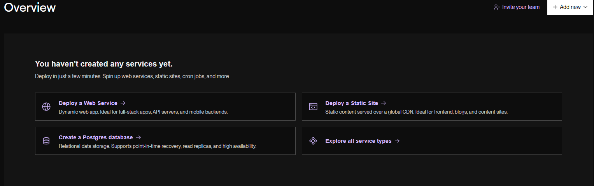

 Step 2: Click Public Git Repository and connect this repository.

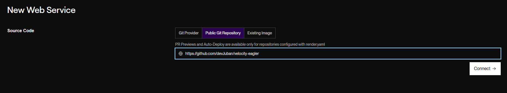

 Step 2.5: Set the name to be your server ip (eg. name: myserverip, ip: myserverip.onrender.com).

 Step 3: Set the branch to "render" and make sure Language is set to Docker.

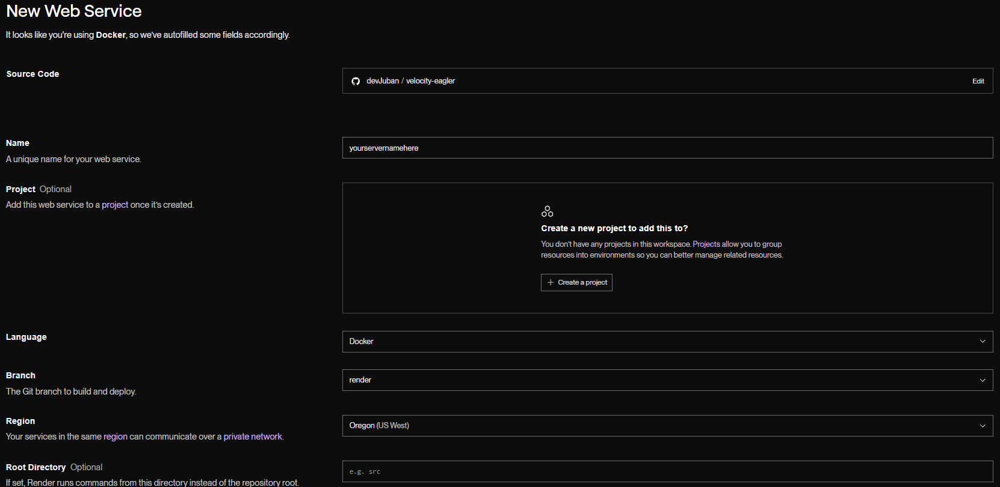

 Step 4: Click for a free Instance Type.

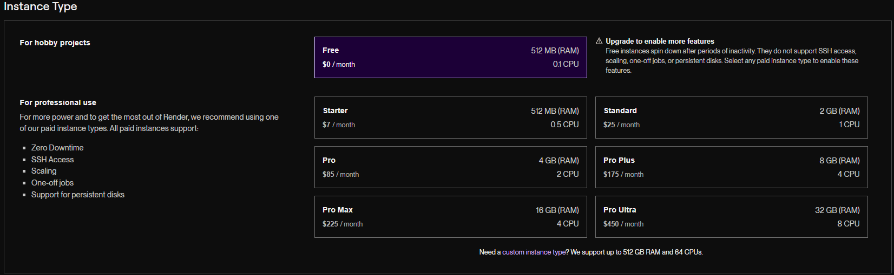

 Step 5: Create 4 Environment Variables (check images for names).

 Step 5.5: For the image make sure the url ends with a .png (this will be your server icon; eg. https://example.com/image<b>.png</b>)

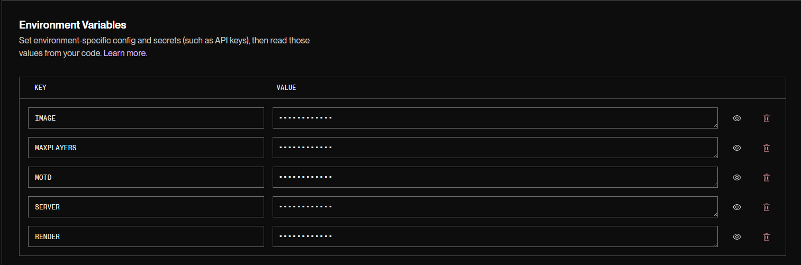

 Step 6: After you deploy the service, Copy the *.onrender.com ip and go to Environment and set RENDER to the ip you copied(*.onrender.com, MAKE SURE YOU COPY THE https://)

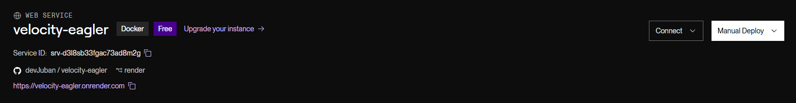
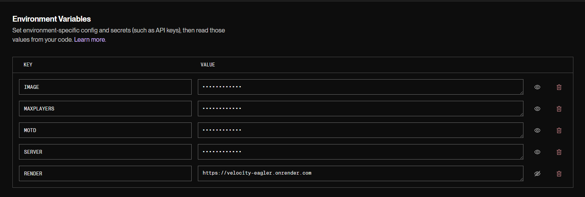

<h1> For Koyeb: </h1>

Step 1: Click Web Service and make sure Github is selected.

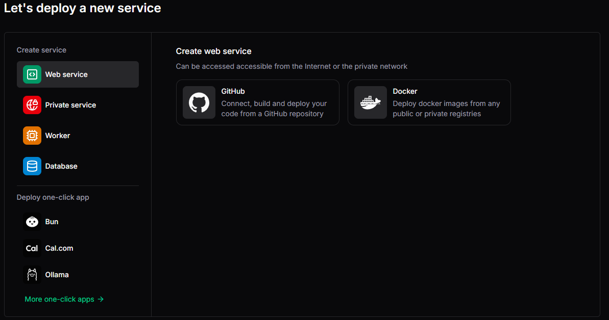

Step 2: Connect this repository.

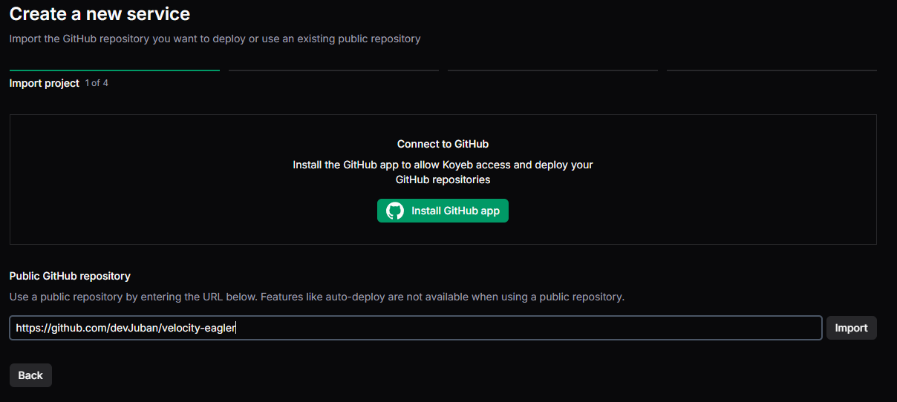

Step 3: Click Dockerfile.

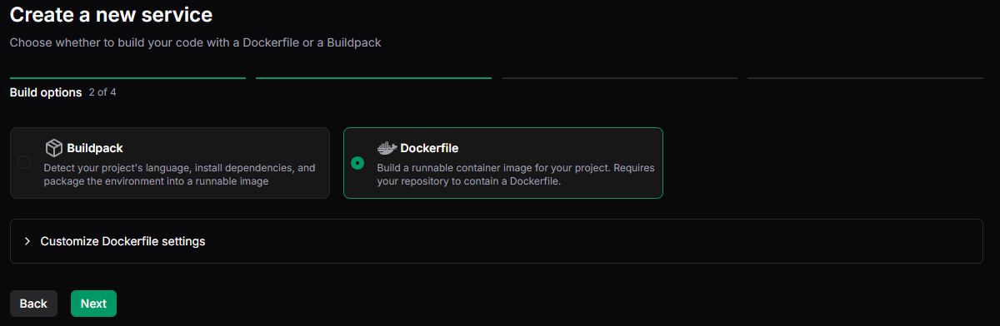

Step 4: Go to CPU Eco and select Free.

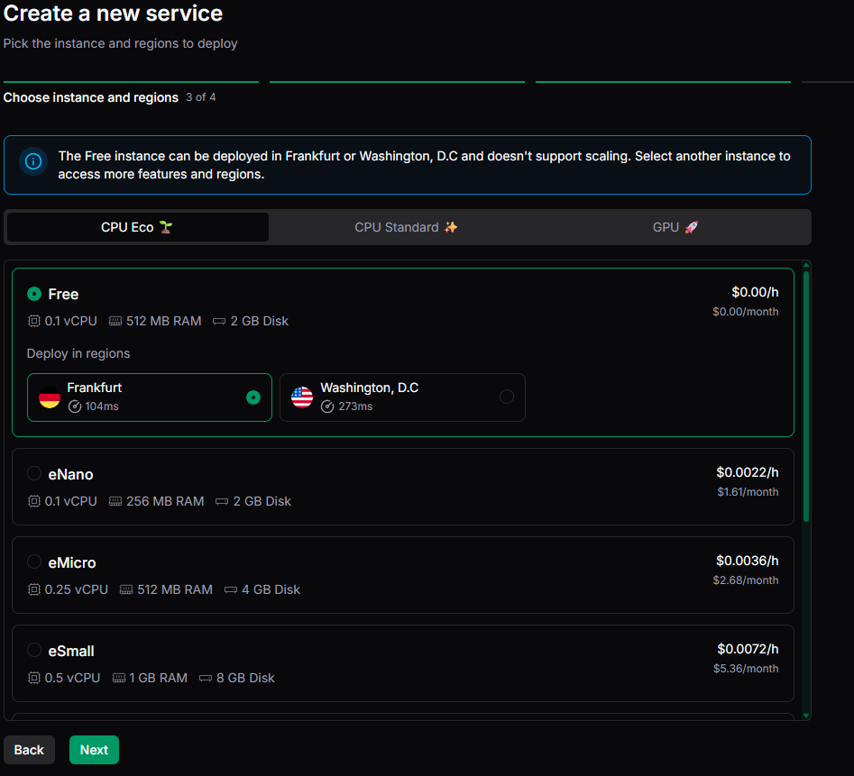

Step 5: Click Source and change the branch to koyeb.

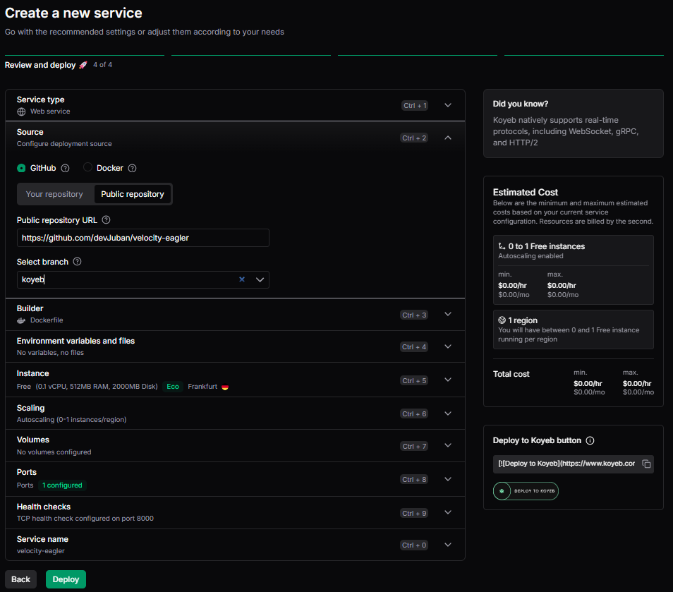

 Step 6: Click Environment Variables and create 3 Environment Variables (check images for names).

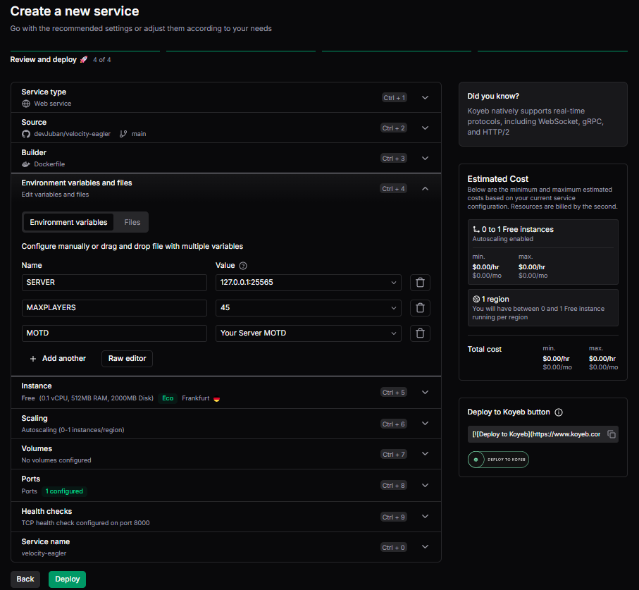

 Step 7: Click on Ports and set the port to be 14457 and tick Proxy TCP access(this will be your java ip, won't work if you use "Hobbyist Plan").

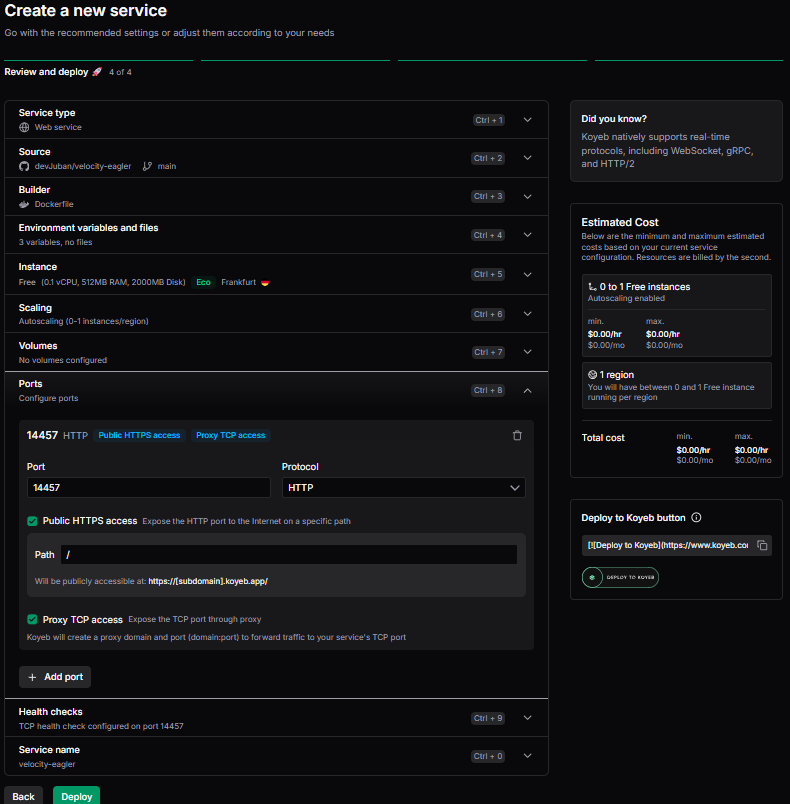
